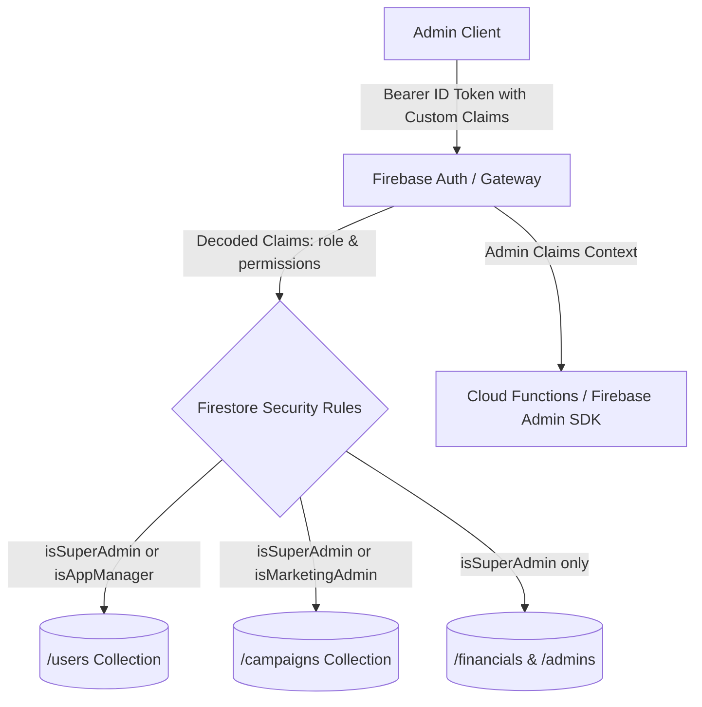

# Tijarah Admin Console — Role-Based Access Control (RBAC) System

A production-grade Admin Console web application with multi-tier **Role-Based Access Control (RBAC)** powered by **Firebase Authentication** and **Firestore Custom Claims**.

---

## 🏛️ Administrative Roles & Permission Matrix

| Role | Role Identifier | Clearance Level | Accessible Features | Strict Role Restrictions |
| :--- | :--- | :--- | :--- | :--- |
| **Super Admin** | `super_admin` | Tier 1 (Root) | Full access to all features, financials, user management, FCM campaigns, settings, and staff role assignment. | *No restrictions* |
| **App / Product Manager** | `app_manager` | Tier 2 | User directory, edit customer info, toggle/extend premium subscriptions, Crashlytics & app health. | **Restricted** from marketing broadcasts (FCM) and financial revenue KPIs. |
| **Marketing Admin** | `marketing_admin` | Tier 3 | FCM push notification center, campaign composer, audience segmentation, delivery & CTR metrics. | **Restricted** from viewing raw user emails, customer lists, subscription records, and crashlytics. |

---

## 🔒 Security Architecture: Frontend & Backend Defense-in-Depth



### 1. Firestore Security Rules (`firestore.rules`)
All read and write requests are verified using token claims:
```javascript
function getRole() {
  return request.auth.token.role;
}

function isSuperAdmin() {
  return request.auth != null && (getRole() == 'super_admin' || request.auth.token.admin == true);
}

function isAppManager() {
  return request.auth != null && (getRole() == 'app_manager' || isSuperAdmin());
}

function isMarketingAdmin() {
  return request.auth != null && (getRole() == 'marketing_admin' || isSuperAdmin());
}

function hasPermission(perm) {
  return isSuperAdmin() || (
    request.auth != null && 
    request.auth.token.permissions != null && 
    perm in request.auth.token.permissions
  );
}
```

### 2. Firebase Admin SDK Custom Claims (`functions/index.js`)
Claims are minted on the server and verified cryptographically in JWT tokens:
```javascript
await admin.auth().setCustomUserClaims(targetUid, {
  role: newRole,
  permissions: customPermissions,
  department: department,
  updated_at: new Date().toISOString(),
});
```

---

## 🚀 Key Features

1. **Top Navigation Persona Switcher**:
   - Instant live toggle between **Sarah Al-Mansoor (Super Admin)**, **David Chen (App Manager)**, and **Chloe Dupont (Marketing Admin)**.
   - **Decoded JWT Claims Inspector** with copyable payload and real-time custom claims sandbox override.
2. **Dynamic UI & Protected Route Guard (`<ProtectedRoute>`)**:
   - Sidebar dynamically highlights or locks sections based on role.
   - Unauthorized access attempts trigger a branded **403 Forbidden State** with missing claims breakdown and persona switch shortcuts.
3. **User Management Directory**:
   - Search, filter by tier (`Free`, `Pro`, `Enterprise`) and status (`Active`, `Suspended`), sorting, pagination.
   - Modal editor for customer metadata, storage quotas, notes, and subscription toggle.
   - CSV data export (Super Admin only).
4. **FCM Push Notification Center**:
   - Push payload composer (Title, Body, Image URL, Deep link URI, Priority, Sound).
   - **Interactive Live Device Frame Preview** (iOS APNs / Android lockscreen simulator).
   - Target audience segmentation without exposing individual customer PII.
   - Broadcast history with CTR and delivery success rate analytics.
5. **Crashlytics Diagnostics**:
   - 99.78% Crash-free users metric gauge.
   - Native stack trace de-obfuscation inspector with one-click copy.
   - Issue status workflow (`Open` ➔ `Investigating` ➔ `Resolved`).
6. **Admin Governance & Custom Claims Matrix**:
   - Super Admin account management, role assignment, and granular permission checkboxes.
   - Live interactive **Firestore Rule Evaluator Sandbox**.
7. **Security Audit Trail**:
   - Immutable log of all administrative actions with before/after diff inspector.

---

## 💻 Local Development

```bash
# Install dependencies
npm install

# Start Vite development server
npm run dev

# Run TypeScript build check
npm run build
```
